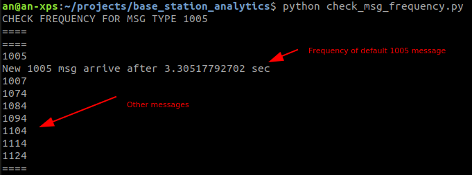
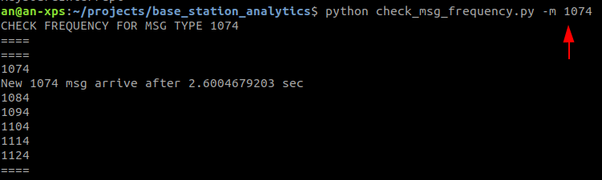

Base Station Analytic Tools
---
A set of tools to understand RTK base station messages

__Tested on Ubuntu 18.04__

1. `check_msg_frequency.py`: use this to check specific message frequency
    __Hardware Requirement:__
    - Connect USB-RS232 device from PC to base station radio or main board.
    
    __How to use__:
    - Default message to check is __1005__ which is the main MSM message that client rover would need from base station. Simply run `python check_msg_frequency.py`
    Example:
    

    - If you want to check other message instead. Run `python check_msg_frequency.py -m other_msg_type`
    Example:
    

