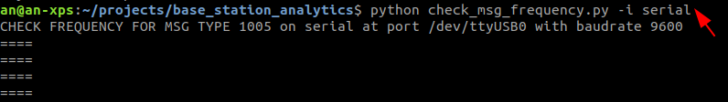
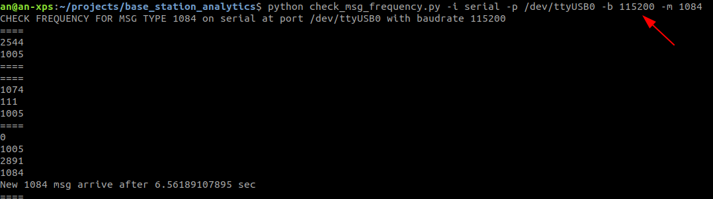

Base Station Analytic Tools
---
A set of tools to understand RTK base station messages

__Tested on Ubuntu 18.04__

1. `check_msg_frequency.py`: use this to check specific message frequency
    __Hardware Requirement:__
    - If perform Serial interface check, connect USB-RS232 device from PC to base station radio or main board.
    - If perform Ethernet interface check, join the network with IP 195.0.0.XX 
    
    __How to use__:
    - Default message to check is __1005__ which is the main MSM message that client rover would need from base station. Simply run `python check_msg_frequency.py` to check on Ethernet or Wifi interface.
    Example:
    

    - If you want to check other message instead on Ethernet or Wifi. Run `python check_msg_frequency.py -m other_msg_type`
    Example:
    
    - If you want to check on Serial/RS-232 at default 9600 baudrate and interface `/dev/ttyUSB0`. Run `python check_msg_frequency.py -i serial`
    Example:
    

    - If you want to check on Serial/RS-232 at 115200 baudrate and interface `/dev/ttyUSB2` and message type 1004. Run `python check_msg_frequency.py -i serial -p /dev/ttyUSB2 -b 115200 -m 1004`
    
